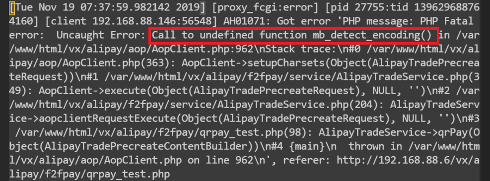

## 支付宝当面付Doem配置心得
下载了官方Dome后，按照官方文档配置后，发现无论怎样配置，通过浏览器测试后均显示500服务器内部错误。很郁闷，不知道错误到底出在了那。换了几个linux版本，问题
依旧。最后通过配置php.ini以便显示更详细的信息，可是折腾了半天都没弄成功。  
后来，想到通过查看linux中的apache日志，来寻找错误。错误原因竟然是安装php的时候少安装了几个模块，经过yum install 相关模块，重启apache后，故障得到排除。
心情瞬间舒畅。  
  
由错误日志可以清楚的看出问题出在了哪里，经过百度搜索缺失的函数，原来是没有安装php_mbstring模块。  
类似的错误还出现在学籍拍照助手中，由于服务器没有安装php_json模块，导致json处理出错，不能把照片和json数据上传至服务器。  
linux日志确实是个好帮手，通过它可以很快的找到问题所在，比在那瞎忙活强的多。

